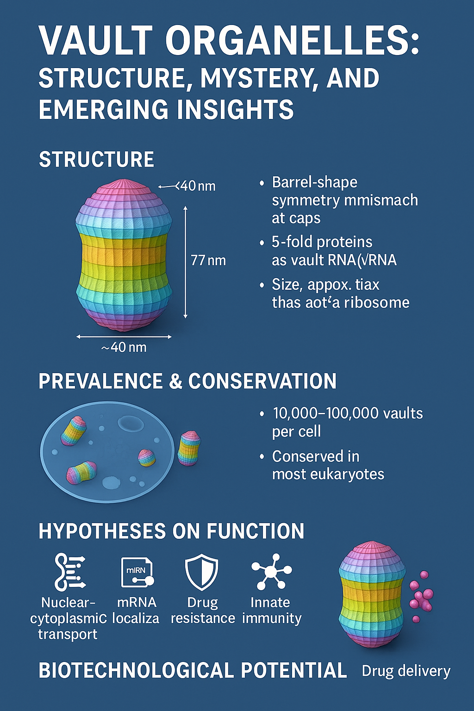

# Vault Organelles: Structure, Mystery, and Emerging Insights  
*AI-Driven Biology Research Repository*

---

## 📑 Project Summary
This repository hosts the research article **“Vault Organelles: Structure, Mystery, and Emerging Insights.”**  
Vaults are large, barrel-shaped ribonucleoprotein complexes present in almost all eukaryotic cells yet whose natural function remains unresolved. Leveraging recent cryo-EM breakthroughs, single-cell omics, and AI-assisted literature synthesis, we present the most comprehensive, forward-looking analysis of vault structure, evolution, and biotechnological potential to date.

---

## 🔑 Keywords & Topics
- **Vault organelle** • ribonucleoprotein • MVP • vRNA / svRNA  
- **Cryo-EM** • symmetry mismatch • nanoscale capsules  
- **Drug delivery** • immuno-oncology • nanobiotechnology  
- **AI in biology** • literature synthesis • knowledge graphs  
- **Evolutionary conservation** • stress response • innate immunity  

---

## 🚀 Why This Matters
Vaults are *abundant, highly conserved,* and structurally elaborate—yet organisms remain viable without them under laboratory conditions. Decoding their role could:
1. **Reveal new stress-response pathways** conserved since the last eukaryotic common ancestor.  
2. **Advance nanomedicine,** using engineered vaults as smart drug-delivery vehicles or vaccine platforms.  
3. **Demonstrate AI-augmented discovery,** showcasing how machine-assisted synthesis accelerates fundamental biology.

---
## 📂 Repository Contents
| Path                                                                                                     | Description                                      |
|----------------------------------------------------------------------------------------------------------|--------------------------------------------------|
| `GPTResearch_Vault Organelles_ Structure, Mystery, and Emerging Insights.pdf`                            | Peer-style research article                      |
| `GeminiResearch_Vault Organelle Mystery Deepens_.pdf`                                                    | Alternate research article or supplementary PDF  |
| `Vault_Organelles.png`                                                                                   | Figure: mysterious_vault_organelles illustration |
| `README.md`                                                                                              | You are here                                     |

---

## ✍️ Citation
If you use this work, please cite:

